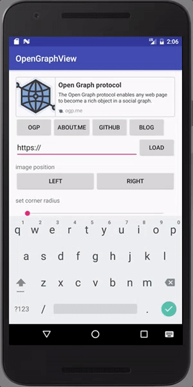

OpenGraphView
===

[ ](https://bintray.com/kaelaela/maven/OpenGraphView/_latestVersion)
[](https://www.apache.org/licenses/LICENSE-2.0)

Rich url link view for Android.



## Usage

```groovy
compile 'me.kaelaela:OpenGraphView:1.0.1'
```

```java
OpenGraphView ogView = new OpenGraphView();
ogView.loadFrom(url);
```

## Attributes

```xml
<me.kaelaela.opengraphview.OpenGraphView
            android:id="@+id/og_view"
            android:layout_width="match_parent"
            android:layout_height="96dp"
            og:bgColor="@android:color/white"
            og:descTextColor="@color/text_black"
            og:faviconPlaceHolder="@color/light_gray"
            og:imagePlaceHolder="@color/light_gray"
            og:separateImage="true"
            og:strokeColor="@color/light_gray"
            og:strokeWidth="2dp"
            og:titleColor="@color/text_black"
            og:urlTextColor="@color/base_gray"
            />
```

| Attribute | Description |
|:---|:---|
| bgColor | Set background color |
| imagePlaceHolder | Set image or drawable to image place holder |
| faviconPlaceHolder | Set image or drawable to favicon place holder |
| separateImage | Set image separator visiblity |
| strokeColor | Set stroke color |
| strokeWidth | Set stroke width |
| titleColor | Set og title text color |
| descTextColor | Set og description text color |
| urlTextColor | Set og url text color |

## Milestone

- [ ] Custom layout
 - [x] View color
 - [ ] View size
 - [x] Text ~~size, line, style,~~ color
 - [ ] Image position
 - [ ] Rounded view
- [ ] Image cache
- [ ] Enable load twitter
- [ ] More metadata

## Me

Yuichi Maekawa(Kaelaela)
* Twitter [@Yuichi0531](https://twitter.com/Yuichi0531)
* kaelaela.31@gmail.com

License
-------
    Copyright (C) 2016 kaelaela
    Copyright (C) 2013 The Android Open Source Project

    Licensed under the Apache License, Version 2.0 (the "License");
    you may not use this file except in compliance with the License.
    You may obtain a copy of the License at

       http://www.apache.org/licenses/LICENSE-2.0

    Unless required by applicable law or agreed to in writing, software
    distributed under the License is distributed on an "AS IS" BASIS,
    WITHOUT WARRANTIES OR CONDITIONS OF ANY KIND, either express or implied.
    See the License for the specific language governing permissions and
    limitations under the License.
